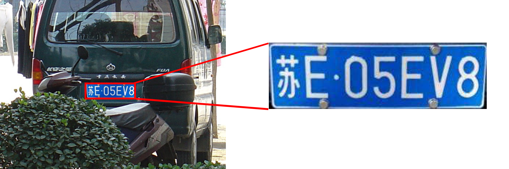
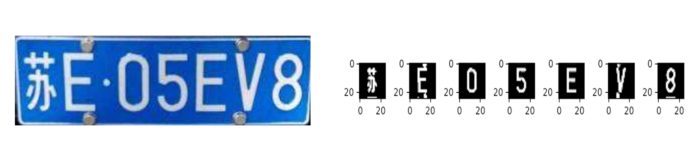

## 问题描述

车牌的检测和识别的应用非常广泛，比如交通违章车牌追踪，小区或地下车库门禁。在对车牌识别和检测的过程中，因为车牌往往是规整的矩形，长宽比相对固定，色调纹理相对固定，常用的方法有：基于形状、基于色调、基于纹理、基于文字特征等方法，近年来随着深度学习的发展也会使用目标检测的一些深度学习方法。

如果要复现本实验，请点击[这里](#run)

## 实现思路

### 车牌定位




### 车牌分割



### 文字识别

  


## 工程和算法

### 目录结构

源码和数据位于src文件夹中，src文件夹中各个子文件功能如下：

* characterData：内含有所有简体中文车牌包含的字符图片数据集（包括省份汉字、字母、数字）
* singledigit：空文件夹，用于存储提取出的单个字符图片
* Car.jpg：示例图片，可以用来测试模型识别效果
* getplate.py：车牌定位、字符分割源码
* main.py：模型训练，字符识别源码


### 运行

* clone到本地后，先运行getplate.py
* 再运行main.py，控制台输出结果


### 车牌定位


```python
import matplotlib.pyplot as plt
import numpy as np
import torch
import cv2
import os


def find_card(I):
    # 识别出车牌区域并返回该区域的图像
    [y, x, z] = I.shape
    # y取值范围分析
    Blue_y = np.zeros((y, 1))
    for i in range(y):
        for j in range(x):
            # 蓝色rgb范围
            temp = I[i, j, :]
            if (I[i, j, 2] <= 30) and (I[i, j, 0] >= 119):
                Blue_y[i][0] += 1
    MaxY = np.argmax(Blue_y)
    PY1 = MaxY
    while (Blue_y[PY1, 0] >= 5) and (PY1 > 0):
        PY1 -= 1
    PY2 = MaxY
    while (Blue_y[PY2, 0] >= 5) and (PY2 < y - 1):
        PY2 += 1
    # x取值
    Blue_x = np.zeros((1, x))
    for i in range(x):
        for j in range(PY1, PY2):
            if (I[j, i, 2] <= 30) and (I[j, i, 0] >= 119):
                Blue_x[0][i] += 1
    PX1 = 0
    while (Blue_x[0, PX1] < 3) and (PX1 < x - 1):
        PX1 += 1
    PX2 = x - 1
    while (Blue_x[0, PX2] < 3) and (PX2 > PX1):
        PX2 -= 1
    # 对车牌区域的修正
    PX1 -= 2
    PX2 += 2
    return I[PY1:PY2, PX1 - 2: PX2, :]


def divide(I):
    [y, x, z] = I.shape
    White_x = np.zeros((x, 1))
    for i in range(x):
        for j in range(y):
            if I[j, i, 1] > 176:
                White_x[i][0] += 1
    return White_x

```


### 车牌分割

```pytho
def divide_each_character(I):
    [y, x, z] = I.shape
    White_x = np.zeros((x, 1))
    for i in range(x):
        for j in range(y):
            if I[j, i, 1] > 176:
                White_x[i][0] += 1
    res = []
    length = 0
    for i in range(White_x.shape[0]):
        # 使用超参数经验分割
        t = I.shape[1] / 297
        num = White_x[i]
        if num > 8:
            length += 1
        elif length > 20 * t:
            res.append([i - length - 2, i + 2])
            length = 0
        else:
            length = 0
    return res
```

定位和分割主函数

```py
if __name__ == '__main__':
    I = cv2.imread('Car.jpg')
    Plate = find_card(I)
    # White_x = divide(Plate)
    plt.imshow(Plate)
    plt.show()
    # plt.plot(np.arange(Plate.shape[1]), White_x)
    res = divide_each_character(Plate)
    plate_save_path = './singledigit/'
    for t in range(len(res)):
        plt.subplot(1, 7, t + 1)
        temp = res[t]
        save_img = cv2.cvtColor(Plate[:, temp[0]:temp[1], :],cv2.COLOR_BGR2GRAY)
        ma = max(save_img.shape[0], save_img.shape[1])
        mi = min(save_img.shape[0], save_img.shape[1])
        ans = np.zeros(shape=(ma, ma, 3),dtype=np.uint8)
        start =int(ma/2-mi/2)
        for i in range(mi):
            for j in range(ma):
                if save_img[j,i] > 125:
                    for k in range(3):
                        ans[j,start+i,k]=255
        ans=cv2.merge([ans[:,:,0],ans[:,:,1],ans[:,:,2]])
        ans=cv2.resize(ans,(25,25))
        dir_name=plate_save_path+str(t)
        os.mkdir(dir_name)
        cv2.imwrite(dir_name+'/'+str(t)+'.jpg',ans)
        plt.imshow(ans)
    plt.show()
```


### 文字识别

```py
from torchvision.datasets import ImageFolder
from torchvision import transforms
from torch.utils.data import DataLoader,SubsetRandomSampler
from torch import nn, optim
import numpy as np
import torch
import time
import sys
import cv2
import os

#车牌字符数组
match = {0: '0', 1: '1', 2: '2', 3: '3', 4: '4', 5: '5', 6: '6', 7: '7', 8: '8', 9: '9', 10: 'A', 11: 'B', 12: 'C',13: '川', 14: 'D', 15: 'E', 16: '鄂',17: 'F', 18: 'G', 19: '赣', 20: '甘', 21: '贵', 22: '桂', 23: 'H', 24: '黑', 25: '沪', 26: 'J', 27: '冀', 28: '津',29: '京', 30: '吉', 31: 'K', 32: 'L', 33: '辽',34: '鲁', 35: 'M', 36: '蒙', 37: '闽', 38: 'N', 39: '宁', 40: 'P', 41: 'Q', 42: '青', 43: '琼', 44: 'R', 45: 'S',46: '陕', 47: '苏', 48: '晋', 49: 'T', 50: 'U',51: 'V', 52: 'W ', 53: '皖', 54: 'X', 55: '湘', 56: '新', 57: 'Y', 58: '豫', 59: '渝', 60: '粤', 61: '云', 62: 'Z',63: '藏', 64: '浙'}


data_path = './characterData/data'
data_transform=transforms.Compose([
    transforms.Grayscale(),
    transforms.ToTensor()
])
dataset=ImageFolder(data_path,transform=data_transform)


validation_split=.1
shuffle_dataset = True
random_seed= 42
batch_size=100
dataset_size = len(dataset)
indices = list(range(dataset_size))
split = int(np.floor(validation_split * dataset_size))
if shuffle_dataset :
    np.random.seed(random_seed)
    np.random.shuffle(indices)
train_indices, val_indices = indices[split:], indices[:split]

train_sampler = SubsetRandomSampler(train_indices)
test_sampler = SubsetRandomSampler(val_indices)

train_iter = DataLoader(dataset, batch_size=batch_size,
                                           sampler=train_sampler)
test_iter = DataLoader(dataset, batch_size=batch_size,
                                                sampler=test_sampler)


#lenet训练
sys.path.append("..")
device = torch.device('cuda' if torch.cuda.is_available() else 'cpu')

class LeNet(nn.Module):
    def __init__(self):
        super(LeNet, self).__init__()
        self.conv = nn.Sequential(
            nn.Conv2d(1, 6, 5), # in_channels, out_channels, kernel_size
            nn.Sigmoid(),
            nn.MaxPool2d(2, 2), # kernel_size, stride
            nn.Conv2d(6, 16, 5),
            nn.Sigmoid(),
            nn.MaxPool2d(2, 2)
        )
        self.fc = nn.Sequential(
            nn.Linear(16*4, 120),
            nn.Sigmoid(),
            nn.Linear(120, 84),
            nn.Sigmoid(),
            nn.Linear(84, 65)
        )

    def forward(self, img):
        feature = self.conv(img)
        output = self.fc(feature.view(img.shape[0], -1))
        return output

def evaluate_accuracy(data_iter, net, device=None):
    if device is None and isinstance(net, torch.nn.Module):
        # 如果没指定device就使用net的device
        device = list(net.parameters())[0].device
    acc_sum, n = 0.0, 0
    with torch.no_grad():
        for X, y in data_iter:
            if isinstance(net, torch.nn.Module):
                net.eval() # 评估模式, 这会关闭dropout
                acc_sum += (net(X.to(device)).argmax(dim=1) == y.to(device)).float().sum().cpu().item()
                net.train() # 改回训练模式
            else: # 自定义的模型, 3.13节之后不会用到, 不考虑GPU
                if('is_training' in net.__code__.co_varnames): # 如果有is_training这个参数
                    # 将is_training设置成False
                    acc_sum += (net(X, is_training=False).argmax(dim=1) == y).float().sum().item()
                else:
                    acc_sum += (net(X).argmax(dim=1) == y).float().sum().item()
            n += y.shape[0]
    return acc_sum / n

def predict(img,net,device=None):
    if device is None and isinstance(net, torch.nn.Module):
        # 如果没指定device就使用net的device
        device = list(net.parameters())[0].device
    res=''
    with torch.no_grad():
        for X,y in img:
            if isinstance(net, torch.nn.Module):
                net.eval() # 评估模式, 这会关闭dropout
                temp=net(X.to(device)).argmax(dim=1)
                x=np.array(X)
                temp=np.array(temp).tolist()
                for i in temp:
                    res+=str(match[i])
                net.train() # 改回训练模式
    return res

# 本函数已保存在d2lzh_pytorch包中方便以后使用
def train_ch5(net, train_iter, test_iter, batch_size, optimizer, device, num_epochs):
    net = net.to(device)
    print("training on ", device)
    loss = torch.nn.CrossEntropyLoss()
    for epoch in range(num_epochs):
        train_l_sum, train_acc_sum, n, batch_count, start = 0.0, 0.0, 0, 0, time.time()
        for X, y in train_iter:
            x=np.array(X)
            Y=np.array(y)
            X = X.to(device)
            y = y.to(device)
            y_hat = net(X)
            l = loss(y_hat, y)
            optimizer.zero_grad()
            l.backward()
            optimizer.step()
            train_l_sum += l.cpu().item()
            train_acc_sum += (y_hat.argmax(dim=1) == y).sum().cpu().item()
            n += y.shape[0]
            batch_count += 1
        test_acc = evaluate_accuracy(test_iter, net)
        print('epoch %d, loss %.4f, train acc %.3f, test acc %.3f, time %.1f sec'
              % (epoch + 1, train_l_sum / batch_count, train_acc_sum / n, test_acc, time.time() - start))


net = LeNet()
print(net)
lr, num_epochs = 0.001, 40
batch_size=256
optimizer = torch.optim.Adam(net.parameters(), lr=lr)
checkpoint_save_path = "./LeNet5.pth"
if os.path.exists(checkpoint_save_path ):
    print('load the model')
    net.load_state_dict(torch.load(checkpoint_save_path))
else:
    train_ch5(net, train_iter, test_iter, batch_size, optimizer, device, num_epochs)
    torch.save(net.state_dict(),checkpoint_save_path)

#识别车牌内容
# plate_paths=os.listdir('./singledigit')
# ans=''
# for plate in plate_paths:
#     #ans+=predict(cv2.imread(plate),net)
#     img=cv2.imread('./singledigit/'+plate)
#     img2=np.zeros(shape=(3,20,20),dtype=torch.float32)
#
#     a=net(torch.from_numpy(img))
# print(ans)

pre_path = './singledigit'
pre_transform=transforms.Compose([
    transforms.Grayscale(),
    transforms.CenterCrop(size=(20,20)),
    transforms.ToTensor()
])
preset=ImageFolder(pre_path,transform=pre_transform)
pre_iter = DataLoader(preset)
ans=predict(pre_iter,net)
print(ans)


```


## 实现效果

```py
runfile('E:/大数据分析方法/workspace/week1/数字图像处理/test05.py', wdir='E:/大数据分析方法/workspace/week1/数字图像处理')

LeNet(
  (conv): Sequential(
    (0): Conv2d(1, 6, kernel_size=(5, 5), stride=(1, 1))
    (1): Sigmoid()
    (2): MaxPool2d(kernel_size=2, stride=2, padding=0, dilation=1, ceil_mode=False)
    (3): Conv2d(6, 16, kernel_size=(5, 5), stride=(1, 1))
    (4): Sigmoid()
    (5): MaxPool2d(kernel_size=2, stride=2, padding=0, dilation=1, ceil_mode=False)
  )
  (fc): Sequential(
    (0): Linear(in_features=64, out_features=120, bias=True)
    (1): Sigmoid()
    (2): Linear(in_features=120, out_features=84, bias=True)
    (3): Sigmoid()
    (4): Linear(in_features=84, out_features=65, bias=True)
  )
)

training on  cpu

epoch 1, loss 3.7474, train acc 0.069, test acc 0.074, time 75.7 sec
epoch 2, loss 3.7088, train acc 0.071, test acc 0.074, time 7.4 sec
epoch 3, loss 3.3383, train acc 0.194, test acc 0.358, time 7.2 sec
epoch 4, loss 2.4473, train acc 0.420, test acc 0.473, time 7.0 sec
epoch 5, loss 1.9042, train acc 0.488, test acc 0.565, time 7.0 sec
epoch 6, loss 1.5477, train acc 0.583, test acc 0.639, time 7.1 sec
epoch 7, loss 1.3139, train acc 0.656, test acc 0.698, time 6.8 sec
epoch 8, loss 1.1450, train acc 0.705, test acc 0.737, time 8.0 sec
epoch 9, loss 1.0151, train acc 0.743, test acc 0.770, time 7.6 sec
epoch 10, loss 0.9199, train acc 0.769, test acc 0.788, time 7.2 sec
epoch 11, loss 0.8415, train acc 0.789, test acc 0.804, time 7.2 sec
epoch 12, loss 0.7789, train acc 0.804, test acc 0.817, time 7.4 sec
epoch 13, loss 0.7240, train acc 0.817, test acc 0.830, time 7.4 sec
epoch 14, loss 0.6803, train acc 0.825, test acc 0.834, time 7.2 sec
epoch 15, loss 0.6408, train acc 0.833, test acc 0.838, time 7.2 sec
epoch 16, loss 0.6064, train acc 0.838, test acc 0.845, time 7.5 sec
epoch 17, loss 0.5785, train acc 0.842, test acc 0.854, time 7.3 sec
epoch 18, loss 0.5502, train acc 0.850, test acc 0.856, time 7.4 sec
epoch 19, loss 0.5278, train acc 0.855, test acc 0.857, time 7.3 sec
epoch 20, loss 0.5028, train acc 0.860, test acc 0.875, time 7.2 sec
epoch 21, loss 0.4820, train acc 0.867, test acc 0.877, time 7.3 sec
epoch 22, loss 0.4622, train acc 0.872, test acc 0.883, time 7.4 sec
epoch 23, loss 0.4424, train acc 0.877, test acc 0.885, time 7.4 sec
epoch 24, loss 0.4264, train acc 0.882, test acc 0.881, time 7.5 sec
epoch 25, loss 0.4106, train acc 0.885, test acc 0.890, time 7.3 sec
epoch 26, loss 0.3957, train acc 0.888, test acc 0.893, time 7.3 sec
epoch 27, loss 0.3803, train acc 0.894, test acc 0.900, time 8.3 sec
epoch 28, loss 0.3695, train acc 0.897, test acc 0.900, time 8.3 sec
epoch 29, loss 0.3538, train acc 0.903, test acc 0.903, time 7.9 sec
epoch 30, loss 0.3421, train acc 0.906, test acc 0.907, time 8.1 sec
```

```py
预测结果为：苏E05EV8
```


## 改进方向

1、车牌定位仅使用了颜色特征

2、车牌分割仅使用了x轴投影波峰波谷

3、卷积神经网络准确率有待提高
